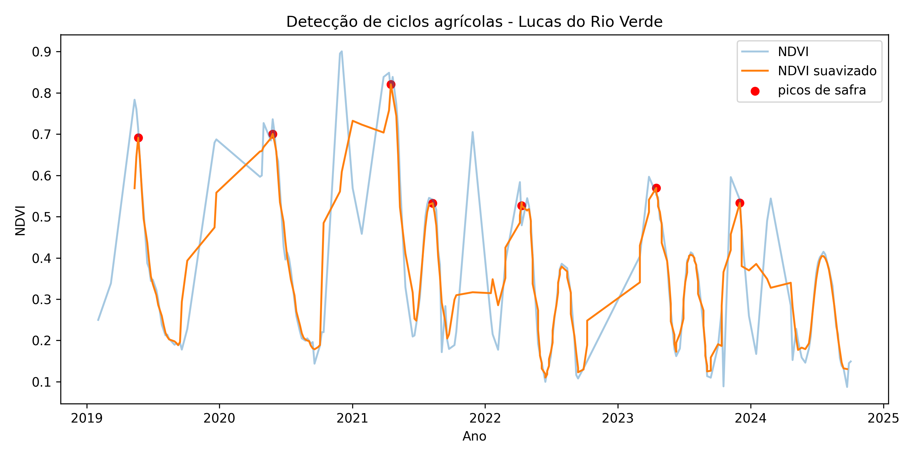

# Agro Spatial Intelligence

## Geospatial Analysis of Soybean Production Density and NDVI

São Paulo – Brazil (2021)

This repository documents a structured geospatial analysis workflow
combining official agricultural statistics and satellite-derived
vegetation metrics.

The project integrates territorial data, agricultural production
statistics from IBGE, and satellite imagery from Sentinel‑2 to explore
spatial patterns of soybean production and vegetation dynamics.

Instead of focusing only on total production volume, this analysis
introduces a territorial density perspective, asking:

  How concentrated is soybean production within each municipality’s
  territory?

This shift from absolute production to spatial intensity reveals
different strategic insights for agribusiness, logistics planning, and
regional analysis.

------------------------------------------------------------------------

### 🎯 Objective

Build a reproducible geospatial analysis pipeline that:

- Collects official agricultural production data (IBGE – SIDRA API)
- Integrates municipal territorial boundaries
- Calculates soybean production density (ton/km²)
- Classifies municipalities statistically
- Generates cartographic outputs and analytical datasets
- Explores vegetation dynamics using Sentinel‑2 NDVI data

The repository also includes exploratory remote sensing scripts for
vegetation monitoring and agricultural cycle detection.

------------------------------------------------------------------------

### 🧠 Methodological Approach

1️⃣ Territorial Base

Municipal boundaries for São Paulo were processed and standardized for
spatial analysis.

Key steps:

- Reprojection to SIRGAS 2000 / UTM Zone 23S (EPSG:31983)
- Municipal area recalculation in km²
- Preparation of a clean territorial dataset for analytical joins

This ensures spatial metrics are calculated in a consistent projected
coordinate system.

------------------------------------------------------------------------

### 2️⃣ Agricultural Data

Agricultural production data was collected from:

IBGE – Produção Agrícola Municipal (PAM)

Dataset details:

Table: 1612
Product: Soybean (Soja em grão)
Variable: Quantity produced (Toneladas)
Year: 2021

Data is retrieved programmatically using the SIDRA API.

------------------------------------------------------------------------

### 3️⃣ Density Calculation

Territorial density was calculated using the formula:

```
    densidade_ton_km2 = producao_ton / area_km2

```
This converts total production into spatial production intensity,
enabling fair comparisons between municipalities with very different
territorial sizes.

------------------------------------------------------------------------

### 4️⃣ Statistical Classification

Municipalities with zero production were isolated before classification
to avoid statistical distortion.

Quantile classification (q = 3) was applied only to positive density
values, generating the categories:

Baixa
Média
Alta

Final classes:

Sem produção
Baixa
Média
Alta

This segmentation highlights areas where soybean production is most
spatially concentrated.

------------------------------------------------------------------------

###📊 Key Insights

Production density is strongly concentrated in the southwest region of
São Paulo.

Coastal municipalities show structural absence of soybean production.

Several municipalities rank high in territorial density despite not
leading in total production volume.

Density-based ranking provides different strategic insights compared to
traditional production ranking.

------------------------------------------------------------------------

### 🛰️ Remote Sensing Experiments

Beyond territorial analysis, the repository includes exploratory remote
sensing scripts using Sentinel‑2 imagery.

These scripts demonstrate how satellite data can complement agricultural
statistics.

NDVI Analysis

Sentinel‑2 imagery is accessed via the Microsoft Planetary Computer STAC
API.

NDVI is calculated using the standard vegetation index formula:

```

    NDVI = (NIR - RED) / (NIR + RED)

```
The analysis clips satellite imagery to municipal boundaries and
extracts vegetation statistics.

Vegetation Time Series

A second experiment builds a multi‑year NDVI time series to detect
agricultural cycles.

Key steps:

- Retrieve Sentinel‑2 scenes across multiple years
- Compute NDVI for each acquisition date
- Smooth the vegetation signal
- Detect peaks and valleys using signal processing

Peak detection identifies vegetation growth cycles associated with
agricultural seasons.

------------------------------------------------------------------------

### 🗺️ Final Output

Categorical territorial density map (gerada em `outputs/`):




------------------------------------------------------------------------

### 🏗️ Project Structure

```
    soy_density_sp/
    │
    ├── data/
    │   ├── raw/
    │   └── processed/
    │
    ├── outputs/
    │   ├── soja_densidade_sp.geojson
    │   ├── soja_densidade_sp.csv
    │   ├── mapa_soja_densidade_sp.png
    │   ├── indice_potencial_sp.geojson
    │   ├── indice_potencial_sp.csv
    │   ├── ndvi_salto_grande.png
    │   ├── ndvi_timeseries_lucas.csv
    │   └── ndvi_crop_cycles_lucas.png
    │
    ├── input/
    │   └── lucas_ag_area.kml
    │
    ├── scripts/
    │   ├── 01_processa_municipios.py
    │   ├── 02_processa_soja.py
    │   ├── 03_merge_densidade.py
    │   ├── 04_gera_mapa.py
    │   ├── 05_indice_potencial.py
    │   ├── 06_ndvi_sentinel.py
    │   └── 07_ndvi_crop_cycles.py
    │
    ├── requirements.txt
    └── README.md
```
------------------------------------------------------------------------

### ▶️ Como executar (Windows)

1. Crie e ative um ambiente virtual:

```powershell
python -m venv .venv
.\.venv\Scripts\Activate.ps1
```

2. Instale dependências:

```powershell
pip install -r requirements.txt
```

3. Execute os scripts em sequência:

```powershell
python scripts\01_processa_municipios.py
python scripts\02_processa_soja.py
python scripts\03_merge_densidade.py
python scripts\04_gera_mapa.py
python scripts\05_indice_potencial.py
python scripts\06_ndvi_sentinel.py
python scripts\07_ndvi_crop_cycles.py
```

> Dica: se quiser rodar apenas parte do fluxo, execute apenas os scripts necessários.

------------------------------------------------------------------------

### ⚙️ Pipeline Overview

- Territorial data processing
- Agricultural data collection via API
- Dataset integration
- Territorial density computation
- Statistical classification
- Map generation and analytical outputs

Additional scripts explore satellite imagery analysis and NDVI
time‑series detection.

------------------------------------------------------------------------

### 🛠️ Technologies Used

- Python 3.11
- Pandas
- GeoPandas
- Matplotlib
- Requests
- Pystac‑client
- Planetary Computer
- Stackstac
- Rioxarray
- SciPy
- IBGE SIDRA API
- Git / GitHub

------------------------------------------------------------------------

### 📌 Potential Applications

Spatial density metrics can support:

- Agricultural credit allocation
- Risk modeling
- Logistics planning
- Regional investment strategy
- Land‑use intensity analysis

Satellite‑derived vegetation indices add complementary insights about
crop dynamics and land cover changes.

------------------------------------------------------------------------

### 🚀 Author

João Luiz de Pádua

Geospatial Data
Agribusiness Intelligence
Spatial Analytics
