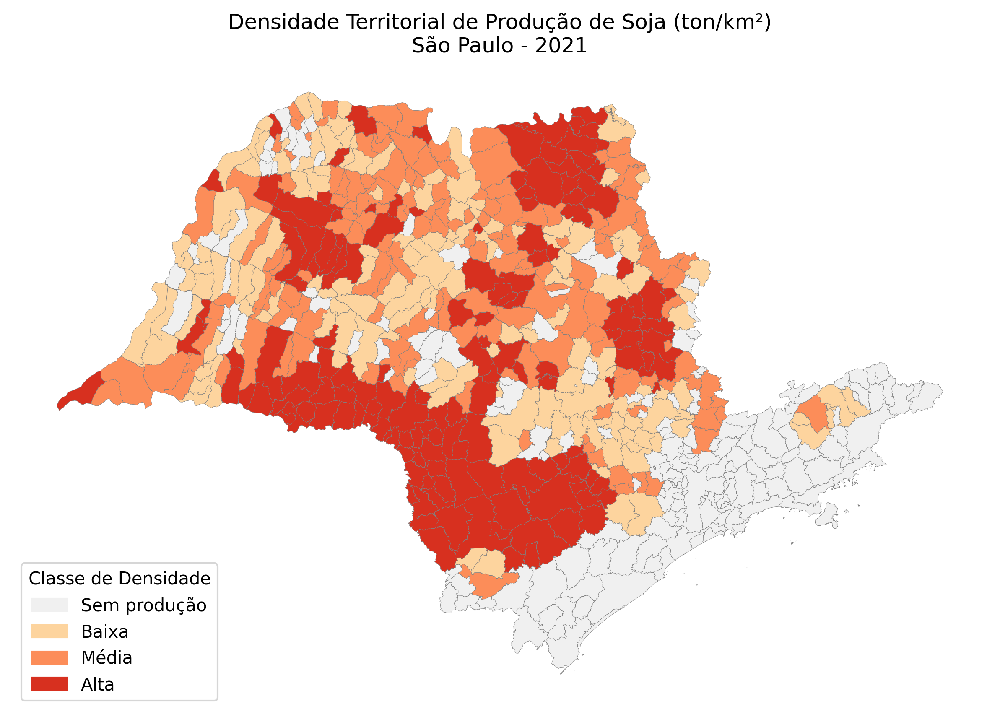

# Agro Spatial Intelligence  
### Territorial Density Analysis of Soybean Production – São Paulo (2021)

---

## 📌 Project Overview

Traditional soybean production analysis ranks municipalities by total output.  
While useful, this approach hides how production is spatially distributed across territory.

This project applies **geospatial analysis** to measure:

> **Territorial Production Density (ton/km²)**

The goal is not to identify the largest producers —  
but to reveal the most territorially concentrated ones.

---

## 🎯 Business Question

Which municipalities in São Paulo concentrate the highest soybean production relative to their territorial area?

How does this spatial density ranking differ from traditional total-production rankings?

---

## 🧠 Why This Matters

Territorial production density introduces a spatial intelligence layer that can support:

- Agricultural credit allocation  
- Commercial expansion strategies  
- Regional specialization assessment  
- Market intelligence for agribusiness  

It shifts the focus from **"who produces more"**  
to **"where production is spatially concentrated"**.

---

## 🗺️ Results Snapshot

The map below highlights soybean territorial density across São Paulo (2021):



Key observation:

- The density ranking differs significantly from total production ranking.
- A strong concentration corridor emerges in the southwest region of São Paulo, near Paraná’s agricultural belt.
- Some municipalities with moderate total production exhibit high territorial concentration.

---

## 🏗️ Methodology

### 1️⃣ Territorial Base

- Official IBGE municipal boundaries (2024)
- Reprojection to metric CRS (SIRGAS 2000 / UTM)
- Municipal area calculation in km²

### 2️⃣ Production Data

- IBGE SIDRA API
- Table 1612 – Lavouras Temporárias
- Variable: Quantity Produced (tons)
- Product: Soybean (grain)
- Year: 2021

### 3️⃣ Data Integration

- LEFT JOIN between territorial and production datasets
- Missing production values treated as zero
- Density metric constructed as:

```python
density_ton_km2 = production_ton / area_km2
📂 Project Structure
agro-spatial-intelligence/
│
├── data/
│   ├── raw/
│   └── processed/
│
├── scripts/
│   ├── 01_processa_municipios.py
│   ├── 02_processa_soja.py
│   ├── 03_merge_densidade.py
│   └── 04_gera_mapa.py
│
├── outputs/
│   ├── soja_densidade_sp.csv
│   ├── soja_densidade_sp.geojson
│   └── mapa_soja_densidade_sp.png
│
├── requirements.txt
└── README.md
⚙️ Tech Stack

Python 3.11

GeoPandas

Pandas

Matplotlib

Requests (SIDRA API)

PyProj / Shapely

📊 Limitations

Density is calculated using total municipal area (not planted area).

Single-year analysis (2021).

Does not include climate or economic variables.

🚀 Future Improvements

Multi-year time series analysis

Soybean vs corn comparison

NDVI integration

Spatial clustering

Predictive modeling

👤 Author

João Luiz de Pádua
Geospatial Intelligence | Agro-Focused Data Analysis